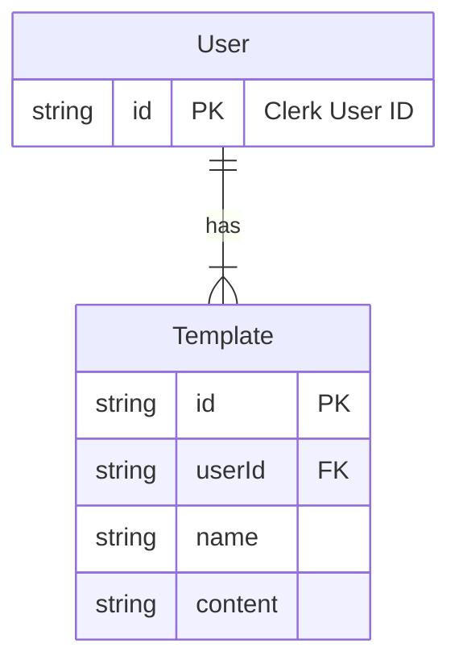

# Levercast Software Architecture Document

## System Design
- A web-based, responsive Single Page Application (SPA) built with Next.js.
- The user interface features a three-column layout for desktop (Input, Editors, Previews) which adapts to a stacked, single-column view on mobile devices.
- The backend logic will be implemented using Next.js API Routes, running in a serverless environment.
- A SQLite database will be used for data persistence, managed via the Prisma ORM.

## Architecture pattern
- **Frontend:** A component-based architecture will be implemented using React. Components will be organized by feature or shared usage.
- **Backend:** A serverless function architecture will be used, with distinct API routes for handling specific functionalities like content generation, publishing, and user authentication.
- **Overall:** The project will follow a monolithic repository structure, where both the frontend and backend code reside within the same Next.js project.

## State management 
- **Local Component State:** React's `useState` and `useReducer` hooks will manage state that is local to specific components, such as the content of input fields and editors.
- **Global Application State:** React Context API will be used for managing global state, such as user session information and authentication status. This avoids the need for a heavier third-party state management library for the initial MVP.

## Data flow 
1.  **Input:** The user provides a content idea via a text area in the client application.
2.  **Generation Request:** The client sends the raw content to a `/api/generate` endpoint.
3.  **AI Processing:** The backend API route forwards the content to a third-party LLM service and receives the formatted post variations for LinkedIn and Twitter.
4.  **Response:** The API returns the generated content to the client.
5.  **UI Update:** The client application state is updated, populating the editor components and triggering a real-time update in the preview components.
6.  **Editing:** As the user edits the content in the editors, the local component state is updated, and the previews re-render instantly.
7.  **Publish Request:** Upon clicking "Publish," the client sends the final content for each platform to a `/api/publish` endpoint.
8.  **Publishing:** The backend API uses the user's stored OAuth tokens to authenticate with the respective social media platforms and publish the content.

## Technical Stack 
- **Framework:** Next.js
- **UI Library:** React
- **Language:** TypeScript
- **Database:** SQLite
- **ORM:** Prisma
- **Styling:** Tailwind CSS
- **Authentication:** Clerk (for handling OAuth with LinkedIn & Twitter)
- **AI Integration:** REST API calls to a third-party LLM provider (e.g., OpenAI, Anthropic).

## Authentication Process
- The authentication process will be managed using `Clerk`.
- Users will connect their LinkedIn and Twitter accounts via an OAuth flow managed by Clerk's pre-built UI components.
- `Clerk` handles the entire user lifecycle, including sign-up, sign-in, session management, and multi-factor authentication.
- The Next.js backend will be protected using Clerk's SDK. API routes will verify the user's session from a token sent by the client.
- Social provider (e.g., LinkedIn, Twitter) OAuth tokens can be retrieved from Clerk's API on the backend when needed to publish content on the user's behalf.

## Route Design 
- **`/` (Home):** The main application page containing the three-column dashboard for content creation.
- **`/api/auth/[...clerk]`:** The catch-all API route for all `Clerk` authentication-related requests (sign in, sign out, callbacks).
- **`/api/generate`:** A `POST` endpoint that accepts raw user input and returns AI-formatted content.
- **`/api/publish`:** A `POST` endpoint that accepts the final edited content and publishes it to the selected social media platforms.

## API Design 
- **`POST /api/generate`**
    - **Request Body:** `{ "prompt": "string" }`
    - **Success Response (200):** `{ "linkedinPost": "string", "twitterPost": "string" }`
    - **Error Response (500):** `{ "error": "Failed to generate content" }`
- **`POST /api/publish`**
    - **Request Body:** `{ "linkedinPost": "string", "twitterPost": "string" }`
    - **Success Response (200):** `{ "status": "Published successfully" }`
    - **Error Response (401):** `{ "error": "Unauthorized" }`
    - **Error Response (500):** `{ "error": "Failed to publish content" }`

## Database Design ERD
The database will use Prisma to manage the schema for application-specific data. User and authentication data will be managed by Clerk. The application's database will store references to the Clerk `userId` to associate data with users.

For example, if we were to store user-specific templates:

The core user, account, and session tables are managed externally by Clerk, simplifying the local database schema.
